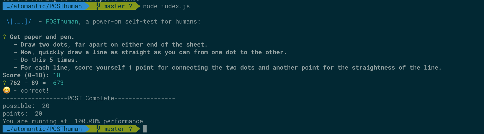

# POSThuman
> A POST for Humans
> Note: this is an early *alpha* work in progress

Wake up feeling groggy? Are you at 100%? 80%?

When a computer wake up, the firmware executes a power-on self-test (POST). This allows the software (mind) to know how the hardware (brain/body) is functioning and to detect if any problems exist that the system should be aware of when executing future tasks.

Likewise, POSThuman is designed to run a diagnostic on human functionality as a wake-up routine.

The exercises are designed to take about 10-15 minutes in total and test everything from hand-eye coordination to simple math mental dexterity to creative word association.

Additionally, many tasks are paired with minor, equipment-free physical stretching exercises.

Do this daily to track your score and improve each task.

> TODO: this would be great as an iOS app with videos demonstrating some of the activities

## Tasks

### Drawing
- paper and pen: draw two dots spread apart on either end of the sheet. Now, quickly draw a line as straight as you can from one dot to the other. Do this 5 times. For each line, score yourself 1 point for connecting the two dots and another point for the straightness of the line. Enter 0-10 for your score.

### Math - Subtraction
- the system will generate quick math puzzles for you to do in your head
- level 0: single digit
- Level 1: double digit - single
- Level 2: double - double
- Level 3 triple - double
- Level 4:  triple - triple

### Math - Multiplication
- the system will generate quick math puzzles for you to do in your head
- level 0: single digit
- Level 1: double digit - single
- Level 2: double - double
- Level 3 triple - double
- Level 4:  triple - triple

### Juggling
- level 1: toss a ball from your dominant hand, gently up to your eye level and catch it again with your dominant hand. Look straight ahead—not at the ball. Do this 5 times with each hand (landing back in the same hand that tossed the ball). Score 1 point for each catch (0-10 points)
- level 2: toss a ball from your dominant hand gently up to eye level, and catch it with your non-dominant hand. From that hand, toss it back the same way. Do this 10 times. Score 0-10, 1 point for each successful catch.
- level 3: (2 balls, one hand)
- level 4: (2 balls, swap hands)
- level 5: (3 balls)
- level 6: (4 balls, 2 each remaining on a side)
- level 7: (4 balls, swapping across)

## Physical + Numerics
- toe touches:
- Do 20 toe touches.
- Level 1: count by 1
- Level 2: count by 2
- Level 3: count by 3
- Level 4: count by powers of 2 (when you get stuck, look at the number key and continue)

### Words
thesaurus prompt
- rhyme prompt
- npm install random-words
- curl https://api.datamuse.com/words?rel_rhy=$1 | jq .
- or https://github.com/sindresorhus/random-word